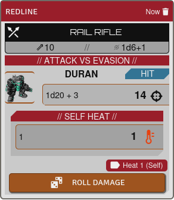
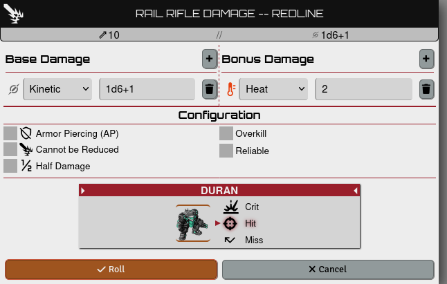
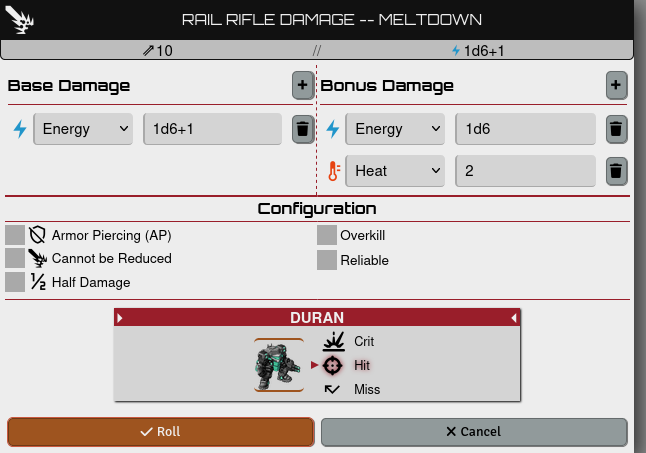
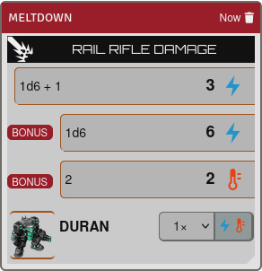
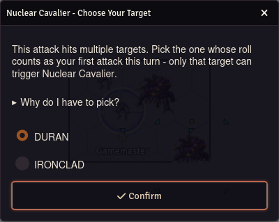

# Lancer Enhanced Nuclear Cavalier

A [Foundry VTT](https://foundryvtt.com/) module for the
[LANCER](https://foundryvtt.com/packages/lancer) system that automates the
Danger Zone-triggered ranks of the **Nuclear Cavalier** talent, which the
system doesn't roll for you.

It does this **as a standalone module**: no system fork, no patched files, no
world migration. It uses LANCER's documented extension points
(`lancer.registerFlows`, the `lancer.postFlow.DamageRollFlow` hook) and stores
its data in an actor flag.

## What it does

| Talent rank | Behaviour |
| --- | --- |
| **Aggressive Heat Bleed** (rank 1) | The first attack roll you make on your turn while in the Danger Zone deals **+2 Heat** on a hit. |
| **Fusion Hemorrhage** (rank 2) | The first ranged or melee attack roll you make on your turn while in the Danger Zone deals **Energy** instead of Kinetic or Explosive, and deals **+1d6 Energy** bonus damage on a hit. |

Rank 3 (**Here, Catch!**, the integrated Fuel Rod Gun) is already handled
elsewhere and is out of scope for this module.

Nuclear Cavalier's own wording is explicit about timing: *"If you enter the
Danger Zone during your turn, this talent takes effect on your next
attack."* So a weapon whose own self-heat (`Heat X (Self)`: *"Immediately
after using this weapon or system, the user takes X Heat"*) is what crosses
you into the Danger Zone doesn't trigger the bonus on that same shot — it
becomes available starting your next attack. A world setting, **"Allow
same-shot self-heat trigger"** (off by default, GM-only), restores the
same-shot behavior for tables that prefer it.

## Install

Manifest URL:

```
https://github.com/KingOfPoptart/lancer-enhanced-nuclear-cavalier/releases/latest/download/module.json
```

Requires the LANCER system 3.0.0+ and Foundry v13. Built and tested against
LANCER 3.1.3.

## Screenshots

Attacking with a Rail Rifle while already in the Danger Zone:



**Aggressive Heat Bleed** adds +2 Heat to that attack's damage roll:



**Fusion Hemorrhage** (rank 2, cumulative with rank 1) converts the base
damage to Energy and stacks its own +1d6 Energy bonus alongside Aggressive
Heat Bleed's +2 Heat, on the same qualifying attack:



The rolled result, both talents applied:



Attacking multiple targets prompts you to pick which one counts as your
first attack roll this turn - before any dice are rolled - since only that
target can trigger Nuclear Cavalier:



## Requirements

The piloting pilot needs the Nuclear Cavalier talent at the relevant rank —
imported from Comp/Con (rank carries over automatically) or added directly as
an item. Ranks are cumulative: a rank 2 pilot's first ranged/melee attack in
the Danger Zone triggers both effects together.

## Development

Plain ES module — no build step. Symlink or copy the repo into your Foundry
`Data/modules/` directory and enable it in a LANCER world.
`globalThis.lancerEnhancedNuclearCavalier` exposes the internals for
debugging. The comment block at the top of `scripts/module.mjs` explains how
each piece works, alongside the known limitations.

## Licence

MIT. LANCER is © Massif Press; this is an unofficial third-party module.
